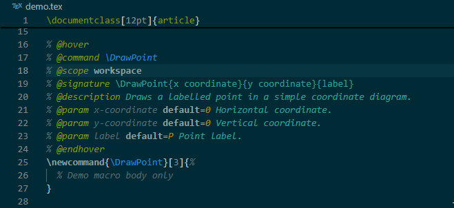
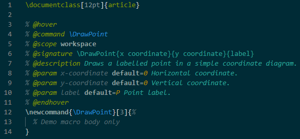

# LaTeX Documentation Hover

Automatically generates hover documentation for your LaTeX macros from comments in your `.tex` files.

Write documentation once in your LaTeX file, save, and hover just works.

Hover over a macro like:

`\DrawPoint`

and see:
- full signature  
- description  
- parameter table (with defaults when provided)  



---

## Core idea

The workflow is simple:

1. Write documentation using special comments  
2. Save the `.tex` file  
3. Hover immediately works  

No manual JSON editing. No extra steps.

---

## What it does

This extension:

- parses structured comment blocks in your LaTeX files  
- generates documentation automatically  
- stores it in `.documentation-hover/docs.json`  
- shows that documentation on hover  
- highlights the documentation blocks for readability  

Built for personal use, but useful for any project with custom macros.

Tested alongside **LaTeX Workshop**.

Note: disabling LaTeX Workshop command hover is optional and only avoids duplicate hover sections.

---

## Writing documentation

Add a block above your macro:

<pre>
<span style="color:#586e75">% </span><span style="color:#b5bd00">@hover</span>
<span style="color:#586e75">% </span><span style="color:#b5bd00">@command</span> <span style="color:#268bd2">\DrawVector</span>
<span style="color:#586e75">% </span><span style="color:#b5bd00">@scope</span> <span style="color:#ffffff">workspace</span>
<span style="color:#586e75">% </span><span style="color:#b5bd00">@signature</span> <span style="color:#268bd2">\DrawVector{x coordinate}{y coordinate}{label}</span>
<span style="color:#586e75">% </span><span style="color:#b5bd00">@description</span> <span style="color:#2aa198"><em>Draws a labelled point in a simple coordinate diagram.</em></span>
<span style="color:#586e75">% </span><span style="color:#b5bd00">@param</span> <span style="color:#839496"><em>x-coordinate</em></span> <span style="color:#ffffff"><strong>default=0</strong></span> <span style="color:#2aa198"><em>Horizontal coordinate.</em></span>
<span style="color:#586e75">% </span><span style="color:#b5bd00">@param</span> <span style="color:#839496"><em>y-coordinate</em></span> <span style="color:#ffffff"><strong>default=0</strong></span> <span style="color:#2aa198"><em>Vertical coordinate.</em></span>
<span style="color:#586e75">% </span><span style="color:#b5bd00">@param</span> <span style="color:#839496"><em>label</em></span> <span style="color:#ffffff"><strong>default=P</strong></span> <span style="color:#2aa198"><em>Point label.</em></span>
<span style="color:#586e75">% </span><span style="color:#b5bd00">@endhover</span>
<span style="color:#268bd2">\newcommand</span>{<span style="color:#268bd2">\DrawPoint</span>}[3]{%
  <span style="color:#586e75">% ..... SOME LATEX</span>
}
</pre>

Save the file. That’s it.

The `@scope` line controls where the hover entry is active.

Supported scopes:

- `workspace` - available in all `.tex` files in the current workspace
- `file` - only available in the file where the documentation block was found
- `files=one.tex,two.tex` - only available in the listed files

Examples:

<pre>
<span style="color:#586e75">% </span><span style="color:#b5bd00">@scope</span> <span style="color:#ffffff">workspace</span>
</pre>

<pre>
<span style="color:#586e75">% </span><span style="color:#b5bd00">@scope</span> <span style="color:#ffffff">file</span>
</pre>

<pre>
<span style="color:#586e75">% </span><span style="color:#b5bd00">@scope</span> <span style="color:#ffffff">files=main.tex,diagrams.tex</span>
</pre>


For most shared macros, use `workspace`. For one-off macros inside a single document, use `file`.

---

## Example

<pre>
<span style="color:#586e75">% </span><span style="color:#b5bd00">@hover</span>
<span style="color:#586e75">% </span><span style="color:#b5bd00">@command</span> <span style="color:#268bd2">\DrawVector</span>
<span style="color:#586e75">% </span><span style="color:#b5bd00">@scope</span> <span style="color:#ffffff">workspace</span>
<span style="color:#586e75">% </span><span style="color:#b5bd00">@signature</span> <span style="color:#268bd2">\DrawVector{start point}{end point}{label}</span>
<span style="color:#586e75">% </span><span style="color:#b5bd00">@description</span> <span style="color:#2aa198"><em>Draws a labelled vector arrow between two points in a TikZ diagram.</em></span>
<span style="color:#586e75">% </span><span style="color:#b5bd00">@param</span> <span style="color:#839496"><em>start-point</em></span> <span style="color:#2aa198"><em>Starting coordinate, such as (0,0).</em></span>
<span style="color:#586e75">% </span><span style="color:#b5bd00">@param</span> <span style="color:#839496"><em>end-point</em></span> <span style="color:#2aa198"><em>Ending coordinate, such as (2,1).</em></span>
<span style="color:#586e75">% </span><span style="color:#b5bd00">@param</span> <span style="color:#839496"><em>label</em></span> <span style="color:#2aa198"><em>Text shown beside the vector.</em></span>
<span style="color:#586e75">% </span><span style="color:#b5bd00">@endhover</span>
<span style="color:#268bd2">\newcommand</span>{<span style="color:#268bd2">\DrawVector</span>}[3]{%
  <span style="color:#586e75">% Demo macro body only</span>
}
</pre>

---

## Generated output

The extension creates:

    .documentation-hover/docs.json

Example:

```json
    {
      "\\DrawVector": {
        "signature": "\\DrawVector{start}{end}{label}",
        "description": "Draws a vector arrow from one point to another.",
        "params": {
          "start": { "desc": "Starting coordinate, e.g. (0,0)" },
          "end": { "desc": "Ending coordinate, e.g. (2,1)" },
          "label": { "default": "\\vec{v}", "desc": "Label shown next to the arrow" }
        }
      }
    }
```
You never need to edit this file manually.

---

## Syntax highlighting

Documentation blocks are highlighted for readability:

- `@hover`, `@command`, `@param`, etc  
- macro names  
- parameter names  
- default values  
- descriptions  


---

## Function highlighting in descriptions

You can highlight functions inline:

<pre>
<span style="color:#586e75">% </span><span style="color:#b5bd00">@description</span> <span style="color:#2aa198"><em>In normal use, call {@fn \DrawPoint} instead.</em></span>
</pre>

This renders as inline code in the hover.

---

## Usage

1. Install the extension  
2. Open a workspace  
3. Add `@hover` blocks  
4. Save  

Hover works immediately.

---

## Build and install from GitHub

    git clone https://github.com/Mondotrasho/latex-documentation-hover.git
    cd latex-documentation-hover
    npm install -g @vscode/vsce
    vsce package

Install:

Windows:

    code --install-extension latex-documentation-hover-0.0.1.vsix --force

macOS/Linux:

    code --install-extension ./latex-documentation-hover-0.0.1.vsix --force

Reload VS Code.

---

## Install through VS Code UI

1. Open Extensions  
2. Click `...`  
3. Install from VSIX  
4. Select the `.vsix`  
5. Reload  

---

## Notes

- Updates automatically on save  
- No manual JSON editing  
- Works with any macros  
- Designed for a fast workflow  

---

## Future ideas

- linting invalid macro parameters  
- signature validation  
- snippet auto-generation  
- support beyond LaTeX
