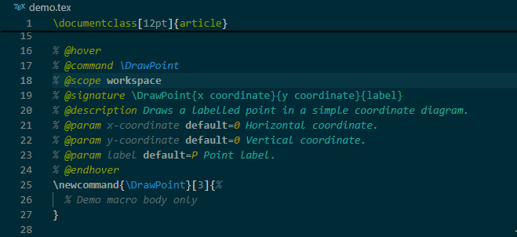
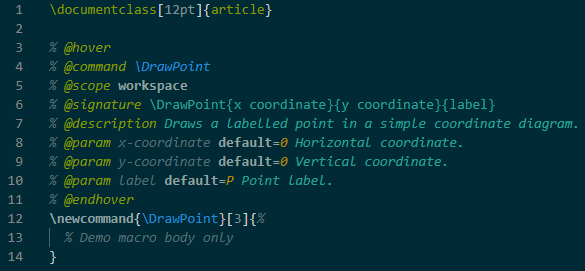

# LaTeX Documentation Hover

Automatically generates hover documentation for your LaTeX macros from comments in your `.tex` files.

Write documentation once in your LaTeX file, save, and hover just works.

Hover over a macro like:

`\DrawPoint`

and see:
- full signature  
- description  
- warnings  
- parameter and key tables (with defaults when provided)  
- copyable examples  



---

## Core idea

The workflow is simple:

1. Write documentation using special comments  
2. Save the `.tex` file  
3. Hover immediately works  

No manual JSON editing. No extra steps.

---

## What it does

This extension:

- parses structured comment blocks in your LaTeX files  
- generates documentation automatically  
- stores it in `.documentation-hover/docs.json`  
- shows that documentation on hover  
- highlights the documentation blocks for readability  

Built for personal use, but useful for any project with custom macros.

Tested alongside **LaTeX Workshop**.

Note: disabling LaTeX Workshop command hover is optional and only avoids duplicate hover sections.

---

## Writing documentation

Add a block above your macro:

<pre>
<span style="color:#586e75">% </span><span style="color:#b5bd00">@hover</span>
<span style="color:#586e75">% </span><span style="color:#b5bd00">@command</span> <span style="color:#268bd2">\DrawPoint</span>
<span style="color:#586e75">% </span><span style="color:#b5bd00">@scope</span> <span style="color:#ffffff">workspace</span>
<span style="color:#586e75">% </span><span style="color:#b5bd00">@signature</span> <span style="color:#268bd2">\DrawPoint{x-coordinate}{y-coordinate}{label}</span>
<span style="color:#586e75">% </span><span style="color:#b5bd00">@description</span> <span style="color:#2aa198"><em>Draws a labelled point in a simple coordinate diagram.</em></span>
<span style="color:#586e75">% </span><span style="color:#b5bd00">@param</span> <span style="color:#839496"><em>x-coordinate</em></span> <span style="color:#ffffff"><strong>default=0</strong></span> <span style="color:#2aa198"><em>Horizontal coordinate.</em></span>
<span style="color:#586e75">% </span><span style="color:#b5bd00">@param</span> <span style="color:#839496"><em>y-coordinate</em></span> <span style="color:#ffffff"><strong>default=0</strong></span> <span style="color:#2aa198"><em>Vertical coordinate.</em></span>
<span style="color:#586e75">% </span><span style="color:#b5bd00">@param</span> <span style="color:#839496"><em>label</em></span> <span style="color:#ffffff"><strong>default=P</strong></span> <span style="color:#2aa198"><em>Point label.</em></span>
<span style="color:#586e75">% </span><span style="color:#b5bd00">@endhover</span>
<span style="color:#268bd2">\newcommand</span>{<span style="color:#268bd2">\DrawPoint</span>}[3]{%
  <span style="color:#586e75">% ..... SOME LATEX</span>
}
</pre>

Save the file. That’s it.

Keep the `@param` names the same as the placeholder words in `@signature`, so the table and the signature read together. Use hyphens rather than spaces in parameter names.

The `@scope` line controls where the hover entry is active.

Supported scopes:

- `workspace` - available in all `.tex` files in the current workspace
- `file` - only available in the file where the documentation block was found
- `files=one.tex,two.tex` - only available in the listed files (paths relative to the workspace root)

Examples:

<pre>
<span style="color:#586e75">% </span><span style="color:#b5bd00">@scope</span> <span style="color:#ffffff">workspace</span>
</pre>

<pre>
<span style="color:#586e75">% </span><span style="color:#b5bd00">@scope</span> <span style="color:#ffffff">file</span>
</pre>

<pre>
<span style="color:#586e75">% </span><span style="color:#b5bd00">@scope</span> <span style="color:#ffffff">files=main.tex,diagrams.tex</span>
</pre>


For most shared macros, use `workspace`. For one-off macros inside a single document, use `file`. If `@scope` is left out, the entry is `workspace`.

---

## Supported tags

| Tag | What it does |
|:----|:-------------|
| `@hover` | Starts a block. |
| `@command` | The macro the hover belongs to. Required, blocks without it are skipped. |
| `@scope` | Where the hover is active. Optional, defaults to `workspace`. |
| `@signature` | Shown at the top of the hover as a LaTeX code block. |
| `@description` | Explanation text. Can be used on several lines. |
| `@warning` | A highlighted warning line. Can be repeated. |
| `@example` | A copyable LaTeX code block. Can be repeated. |
| `@param` | A row in the parameter table. |
| `@key` | A row in the key table, for key-value options. |
| `@endhover` | Ends a block. |

`@doc` / `@enddoc`, `@lh-doc` / `@end-lh-doc` and a bare `@end` also work as block markers, if you prefer them.

Typing `@hover` in a `.tex` file offers a snippet with the whole block laid out in the usual order:

<pre>
<span style="color:#586e75">% </span><span style="color:#b5bd00">@hover</span>
<span style="color:#586e75">% </span><span style="color:#b5bd00">@command</span>
<span style="color:#586e75">% </span><span style="color:#b5bd00">@scope</span>
<span style="color:#586e75">% </span><span style="color:#b5bd00">@signature</span>
<span style="color:#586e75">% </span><span style="color:#b5bd00">@description</span>
<span style="color:#586e75">% </span><span style="color:#b5bd00">@warning</span>
<span style="color:#586e75">% </span><span style="color:#b5bd00">@example</span>
<span style="color:#586e75">% </span><span style="color:#b5bd00">@param</span>
<span style="color:#586e75">% </span><span style="color:#b5bd00">@key</span>
<span style="color:#586e75">% </span><span style="color:#b5bd00">@endhover</span>
</pre>

The hover itself is always shown in the same order regardless of where the lines are in the block: signature, description, warnings, the parameter/key table, then examples.

---

## Longer descriptions

Repeat `@description` for each line:

<pre>
<span style="color:#586e75">% </span><span style="color:#b5bd00">@description</span> <span style="color:#2aa198"><em>Places a board and exports its pin coordinates.</em></span>
<span style="color:#586e75">% </span><span style="color:#b5bd00">@description</span> <span style="color:#2aa198"><em>Use a different board name for every board in the same picture.</em></span>
</pre>

The lines are joined into one paragraph in the hover.

Every line inside a block needs a tag. A plain comment line is skipped, so this second line never reaches the hover:

<pre>
<span style="color:#586e75">% </span><span style="color:#b5bd00">@description</span> <span style="color:#2aa198"><em>Places a board and exports its pin coordinates.</em></span>
<span style="color:#586e75">% Use a different board name for every board in the same picture.</span>
</pre>

---

## Warnings and examples

<pre>
<span style="color:#586e75">% </span><span style="color:#b5bd00">@warning</span> <span style="color:#dc322f"><em>Must be called before any wires are drawn.</em></span>
<span style="color:#586e75">% </span><span style="color:#b5bd00">@example</span> <span style="color:#268bd2">\PlaceNano{nano}{(0,0)}</span>
<span style="color:#586e75">% </span><span style="color:#b5bd00">@example</span> <span style="color:#268bd2">\PlaceNano[orientation=left]{nano}{(4,0)}</span>
</pre>

Each `@warning` gets its own highlighted line. Each `@example` becomes its own code block, so keep examples to one line each.

---

## Key-value options

For macros that take `key=value` options, document the keys with `@key`. They go in the same table as the parameters, under their own **Key** heading.

<pre>
<span style="color:#586e75">% </span><span style="color:#b5bd00">@signature</span> <span style="color:#268bd2">\PlaceNano[options]{name}{position}</span>
<span style="color:#586e75">% </span><span style="color:#b5bd00">@param</span> <span style="color:#839496"><em>name</em></span> <span style="color:#2aa198"><em>Board name used as the coordinate prefix.</em></span>
<span style="color:#586e75">% </span><span style="color:#b5bd00">@param</span> <span style="color:#839496"><em>position</em></span> <span style="color:#2aa198"><em>Placement coordinate, such as (0,0).</em></span>
<span style="color:#586e75">% </span><span style="color:#b5bd00">@key</span> <span style="color:#839496"><em>orientation</em></span> <span style="color:#ffffff"><strong>default=up</strong></span> <span style="color:#2aa198"><em>Board orientation. Valid values: up, right, down, left.</em></span>
<span style="color:#586e75">% </span><span style="color:#b5bd00">@key</span> <span style="color:#839496"><em>line width</em></span> <span style="color:#ffffff"><strong>default=6.0pt</strong></span> <span style="color:#2aa198"><em>Width of the wire.</em></span>
</pre>

---

## Names and defaults

`@param` and `@key` lines follow the same rules:

- `default=` is optional. Without it, the Default column is left empty.
- With `default=`, everything before it is the name, so multi-word TikZ keys like `line width` just work.
- Without `default=`, the name is the first word. Quote multi-word names: `@key "line width" Width of the wire.`
- A default ends at the first space. Quote defaults that contain spaces: `default="on 2pt off 1pt"`.
- `default=""` means no default.
- Don't write `default=` inside a description; it will be read as the default.

The Default column only appears when at least one row has a default.

---

## Generated output

The extension creates:

    .documentation-hover/docs.json

Example:

```json
    {
      "\\DrawVector": {
        "source": "diagrams.tex",
        "scope": { "type": "workspace" },
        "signature": "\\DrawVector{start}{end}{label}",
        "description": "Draws a vector arrow from one point to another.",
        "warnings": [],
        "examples": ["\\DrawVector{(0,0)}{(2,1)}{v}"],
        "params": {
          "start": { "default": "", "desc": "Starting coordinate, e.g. (0,0)" },
          "end": { "default": "", "desc": "Ending coordinate, e.g. (2,1)" },
          "label": { "default": "\\vec{v}", "desc": "Label shown next to the arrow" }
        },
        "keys": {}
      }
    }
```
You never need to edit this file manually.

It is rebuilt from every `.tex` file in the workspace each time one is saved. You can also rebuild it from the Command Palette with **LaTeX Documentation Hover: Generate docs.json**.

Each macro should be documented in one place. If two files document the same `@command`, only one of them ends up in `docs.json`.

---

## Syntax highlighting

Documentation blocks are highlighted for readability:

- `@hover`, `@command`, `@param`, etc  
- macro names  
- parameter names  
- default values  
- descriptions  


---

## Function highlighting in descriptions

You can highlight functions inline:

<pre>
<span style="color:#586e75">% </span><span style="color:#b5bd00">@description</span> <span style="color:#2aa198"><em>In normal use, call {@fn \DrawPoint} instead.</em></span>
</pre>

This renders as inline code in the hover. `{\fn \DrawPoint}` works too.

`{@fn}` ends at the first `}`, so use it for macro names only. For code with braces, use backticks:

<pre>
<span style="color:#586e75">% </span><span style="color:#b5bd00">@description</span> <span style="color:#2aa198"><em>Equivalent to `\PlaceNano[orientation=up]{nano}{(0,0)}`.</em></span>
</pre>

Descriptions are rendered as Markdown, so backticks are also the way to keep things like `\%`, `\_` and `*` exactly as written.

---

## What can be hovered

Hover works on any command made of letters, `@`, `:` and `_`, so internal macros are covered too:

- `\DrawPoint`
- `\my@helper`
- `\memory_arrow_parse:n`

Keys, TikZ styles, colours and environment names can't be hovered on their own. Document keys with `@key` on the macros that use them.

---

## Usage

1. Install the extension  
2. Open a workspace  
3. Add `@hover` blocks  
4. Save  

Hover works immediately.

---

## Build and install from GitHub

    git clone https://github.com/Mondotrasho/latex-documentation-hover.git
    cd latex-documentation-hover
    npm install -g @vscode/vsce
    vsce package

Install:

Windows:

    code.cmd --install-extension latex-documentation-hover-0.0.4.vsix --force

macOS/Linux:

    code --install-extension ./latex-documentation-hover-0.0.4.vsix --force

Reload VS Code.

---

## Install through VS Code UI

1. Open Extensions  
2. Click `...`  
3. Install from VSIX  
4. Select the `.vsix`  
5. Reload  

---

## Notes

- Updates automatically on save  
- No manual JSON editing  
- Works with any macros  
- Designed for a fast workflow  

---

## Future ideas

- linting invalid macro parameters  
- signature validation  
- snippet auto-generation  
- support beyond LaTeX
